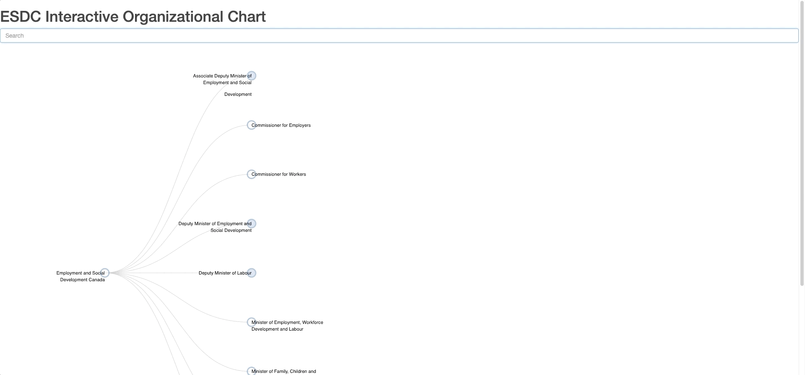
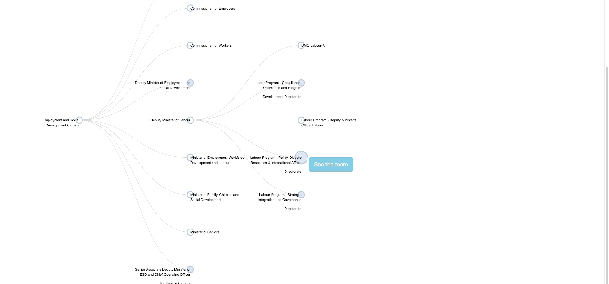

# Government of Canada Employee Directorate Viewer
> The [Government Electronic Directory Services (GEDS)](http://gcdirectory-gcannuaire.ssc-spc.gc.ca/en/GCD/?pgid=009) provides public access to Government of Canada employee contact information as provided by participating departments. The dataset underlying GEDS has been published [here](https://open.canada.ca/data/en/dataset/8ec4a9df-b76b-4a67-8f93-cdbc2e040098) on the Government of Canada's [Open Data](https://open.canada.ca/en/open-data) portal. The purpose of this project is to use this data to produce a searchable organization chart for the Government of Canada. 
## Feature Overview
The application is currently set up for the organization structure of Employment and Social Development Canada (ESDC). However, minimal changes are required to implement the same functionality for other government departments whose information is available on GEDS.

### 1. Dynamically Explore the Organization
The Interactive Organizational Chart is based off of the [interactive tree diagram](http://bl.ocks.org/d3noob/8375092) by d3.js - the user can explore the organizational chart interactively by clicking on the nodes of the tree.


### 2. Search for a Specific Business Unit
Using the search bar at the top of the page, the user can search for a specific business unit, and the interactive chart will open to the node containing the unit they requested.



### 3. Get the Contact Info for Each Person on the Team (partially implemented)
This feature is still in progress - when finished it will send an AJAX request to a back-end API that looks up the contact information for each person in a particular business unit. The below animation illustrates this with two fake observations.



### 4. Set Up the Back-end API and Plug it Into Another Project (not yet implemented)
This feature has not yet been implemented. This feature will provide the contact information for feature #3, and can also be able to be used as a RESTful API in other applications.

When finished, there will be (at least) three end-points: ```/search-org-chart``` which will return the path to a particular business unit and also the names of its parents and children (if any); ```/search-person``` which will search for an employee by name and return the contact information for that employee (or a list of employees if more than one match is found); and ```/search-team``` which will return the contact information for all employees that belong to a particular team/business unit.


## Installation

Installation details will be updated once a stable version has been completed.

## Development setup

The back-end API is run on a Flask server. More documentation will be added once this feature is complete.

## Release History

* 0.0.1
    * Work in progress

## Meta

Collin Brown – collin.brown@hrsdc-rhdcc.gc.ca

[https://github.com/Collinbrown95/goc-org-chart](https://github.com/Collinbrown95/goc-org-chart)

## Contributing

1. Fork it (<https://github.com/Collinbrown95/goc-org-chart/fork>)
2. Create your feature branch (`git checkout -b feature/fooBar`)
3. Commit your changes (`git commit -am 'Add some fooBar'`)
4. Push to the branch (`git push origin feature/fooBar`)
5. Create a new Pull Request
