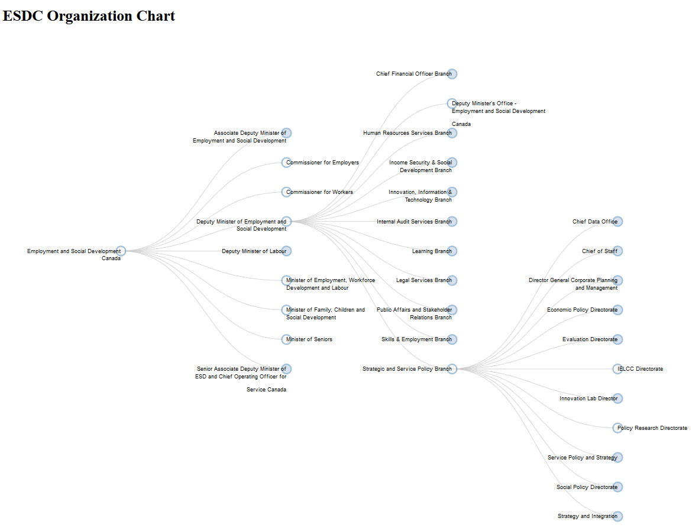

# Government of Canada Employee Directorate Viewer
> The [Government Electronic Directory Services (GEDS)](http://gcdirectory-gcannuaire.ssc-spc.gc.ca/en/GCD/?pgid=009) provides public access to Government of Canada employee contact information as provided by participating departments. The dataset underlying GEDS has been published [here](https://open.canada.ca/data/en/dataset/8ec4a9df-b76b-4a67-8f93-cdbc2e040098) on the Government of Canada's [Open Data](https://open.canada.ca/en/open-data) portal. The purpose of this project is to use this data to produce a searchable organization chart for the Government of Canada. 

## Installation

Currently, the tool is contained entirely client-side javascript - just open `org-struct-diagram.html` in a compatable browser (all browsers except for IE are currently supported). 

## Usage example

The tool can be used on its own, or it can be searched by modifying the `node` parameter in the URL. There is currently no U.I. on the page to perform this search, but by modifying this parameter with a compatible node name, 

## Development setup

The python scripts in this repository (`prepare_org_structure_data.py` and `searching_org_struc_json.py`) require Python 3.* and use pandas.

## Release History

* 0.0.1
    * Work in progress

## Meta

Collin Brown – collin.brown@hrsdc-rhdcc.gc.ca

Distributed under the XYZ license. See ``LICENSE`` for more information.

[https://github.com/Collinbrown95/goc-org-chart](https://github.com/Collinbrown95/goc-org-chart)

## Contributing

1. Fork it (<https://github.com/Collinbrown95/goc-org-chart/fork>)
2. Create your feature branch (`git checkout -b feature/fooBar`)
3. Commit your changes (`git commit -am 'Add some fooBar'`)
4. Push to the branch (`git push origin feature/fooBar`)
5. Create a new Pull Request
